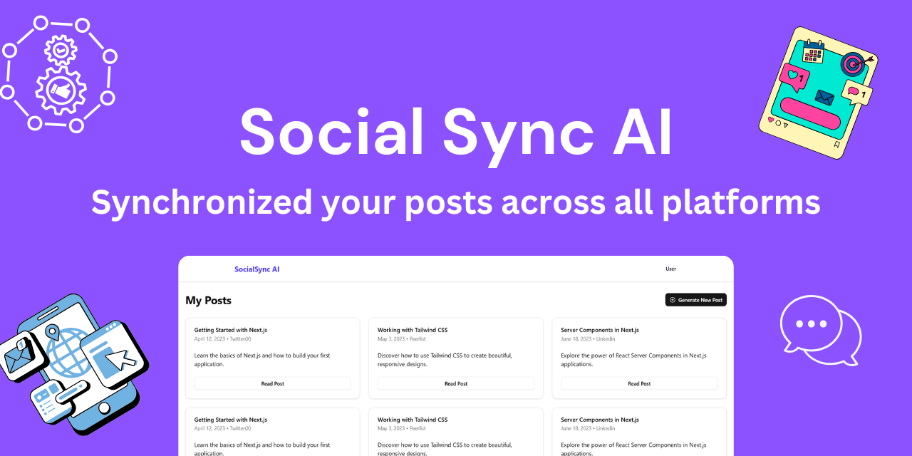

# Social Sync AI




## Introduction

Sharing achievements across multiple social media platforms can be a tedious process. Writing a detailed post for LinkedIn, optimizing it for X (Twitter) due to character limits, and modifying it further for Peerlist is time-consuming.

Introducing **Social Sync AI** – a tool designed to streamline this process. With Social Sync AI, you can write a single descriptive post, and our platform will generate platform-specific versions for LinkedIn, Peerlist, and X.

Additionally, if you follow a structured format for social media posts, you can provide an **'Inspiration' post**, and Social Sync AI will generate new content following the same structure.

## Features

- **AI-powered content transformation**: Automatically generate platform-optimized posts.
- **Customizable formatting**: Follow your preferred structure using an inspiration post.
- **Multi-platform support**: Generate posts for LinkedIn, Peerlist, and X.
- **Seamless UI/UX**: Easy-to-use interface for content creation and management.

## Installation and Usage

### Setup

```bash
mkdir socialSyncAI # Create a directory for the project
cd socialSyncAI # Navigate to the directory
git clone https://github.com/Gitax18/social-sync-ai . # Clone the repository
```

### Backend

```bash
cd backend # Navigate to backend directory
npm install # Install dependencies
npm start # Start the server (default: port 3000)
```

### Frontend

```bash
cd frontend
npm install
npm run dev
```

## Tech Stack

### Frontend

|      Technology       |    Name     |
| :-------------------: | :---------: |
|     **Language**      | Javascript  |
|     **Framework**     |   Next.JS   |
| **Component Library** |   ShadCN    |
|      **Styling**      | TailwindCSS |

### Backend

|  Technology  |        Name        |
| :----------: | :----------------: |
| **Language** |     JavaScript     |
| **Library**  |     Express.JS     |
|    **AI**    |      Groq AI       |
| **Database** | MongoDB & Mongoose |

## Features Under Development

- **Two-Factor Authentication** (In progress)
- **Saving generated posts** for future reference
- **Viewing saved posts** within the platform

## Future Scope

- **Credit-based limitations**: Restrict free users to 3 post generations per day.
- **Subscription Model**:
  - Pro users can generate up to 20 posts per week.
  - Pro users can switch AI models for improved content generation.

## License

This project is licensed under the **MIT License**.

## ✍️ Authors

- Gitanshu Sankhla (Backend Developer) -

  [](https://github.com/Gitax18) [](https://linkedin.com/in/gitanshu-sankhla)
  [](https://www.instagram.com/gitanshusankhla)

- Nehal Jain (Backend Developer) -
- [](https://github.com/thebraudalf) [](https://www.linkedin.com/in/nehaljain05/)
  [](https://www.instagram.com/the_braudalf/)

- Shubham Rakhecha (Frontend Developer)
- [](https://github.com/skysparko) [](https://www.linkedin.com/in/shubham-rakhecha-75a3b621a/)
  [](https://www.instagram.com/fake.sparko/)
